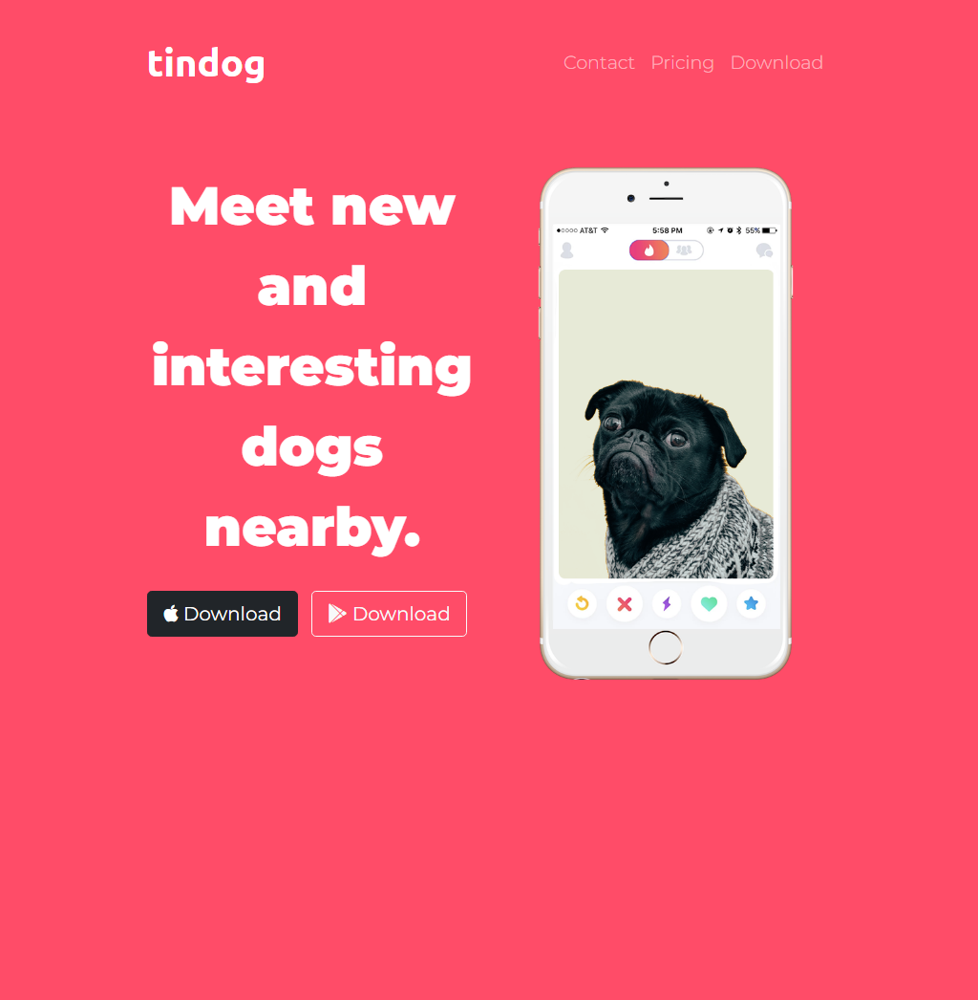
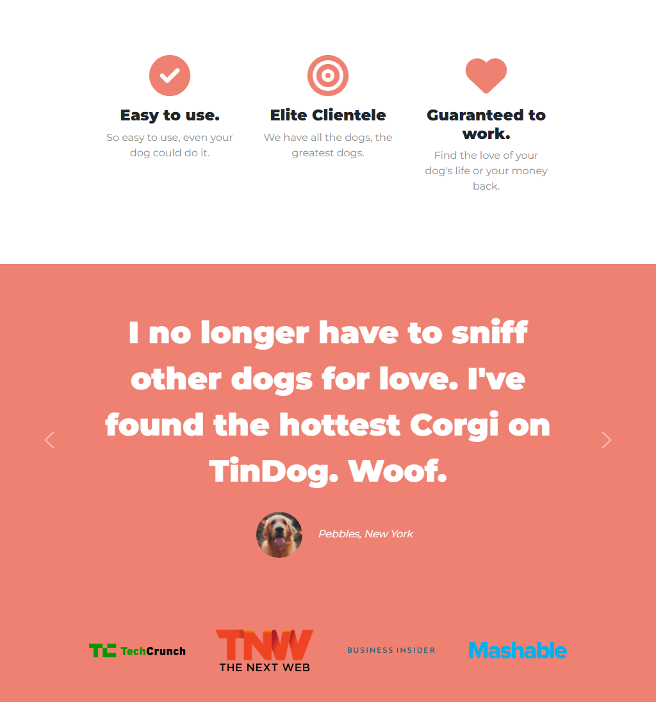
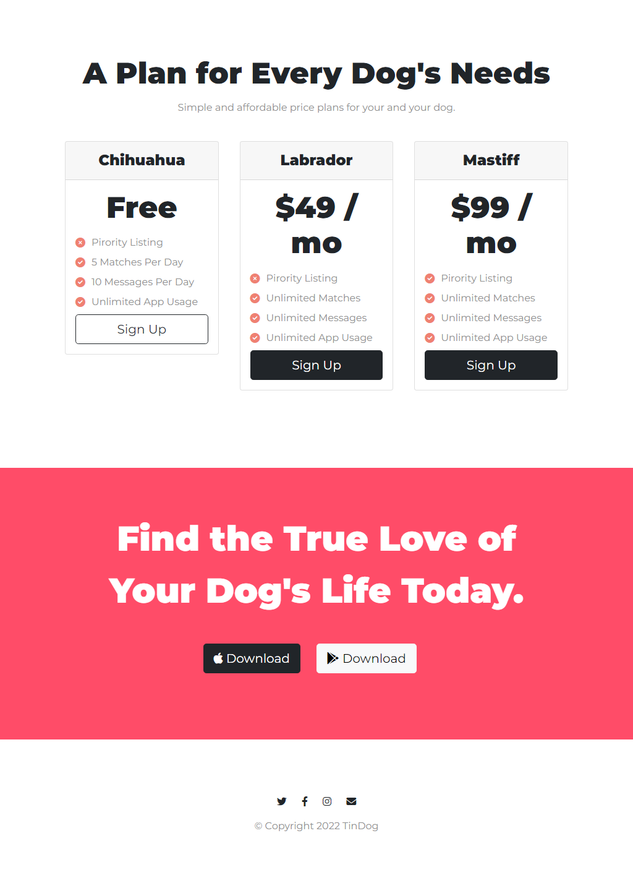

# tinDog - Canine Connection Apsp

Welcome to tinDog, the ultimate platform for dog lovers to meet nearby dogs and potentially find their true love. Inspired by Tinder, tinDog is designed to connect people through their shared love for dogs. Swipe right to meet your furry friend or even your future life partner. Get started now and unleash the world of doggy happiness!

## Table of Contents

- [Demo](#demo)
- [Technologies Used](#technologies-used)
- [Features](#features)
- [Screenshots](#screenshots)
- [Getting Started](#getting-started)
- [Contributing](#contributing)
- [License](#license)

## Demo

Check out the live demo: [tinDog Live Demo](https://ahsancommits.github.io/tinDog)

## Technologies Used

This app is built using the following technologies:

- HTML
- CSS
- JavaScript
- Bootstrap
- Responsive Design

## Features

- User-friendly, Tinder-inspired interface for dog lovers.
- Find nearby dogs and their owners.
- Swipe right to like and connect with others.
- Explore a world of doggy happiness.
- Connect with like-minded dog enthusiasts.
- Responsive design for a seamless experience on all devices.

## Screenshots







## Getting Started

Follow these steps to get a copy of the project up and running on your local machine.

1. Clone the repository:

   ```shell
   git clone https://github.com/ahsancommits/tinDog.git
   ```

2. Open the project directory:

   ```shell
   cd tinDog
   ```

3. Open the `index.html` file in your web browser to start using tinDog.

## Contributing

We welcome contributions from the community. If you have ideas for improvements or find any issues, please submit a pull request or open an issue in this repository.

Enjoy connecting with fellow dog lovers on tinDog! 🐶❤️
